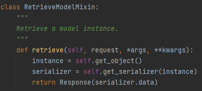
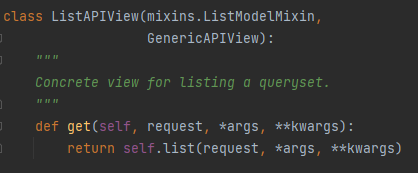
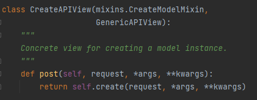
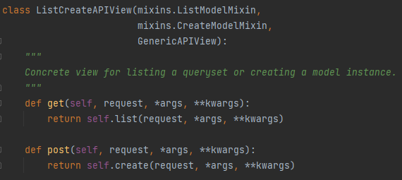

# Оглавление


# 1. Использование GenericApiView

`GenericAPIView` - это представление в Django REST Framework, которое предоставляет множество удобных методов и функциональности для работы с API 
на основе обобщенных (`generic`) представлений. 
Они представляют собой высокоуровневый способ создания API, который обрабатывает множество типичных сценариев, 
таких как создание, чтение, обновление и удаление объектов.

`GenericAPIView` - это просто более высокоуровневое представление `APIView` 

Преимущества использования `GenericAPIView`:

* `Упрощенный код`: `GenericAPIView` позволяет сократить количество кода благодаря использованию предварительно 
реализованных методов для типичных операций `CRUD` (`Create`, `Retrieve`, `Update`, `Delete`).


* `Гибкость и настраиваемость`: Они предоставляют гибкую и настраиваемую структуру для создания API, 
позволяя вам добавлять пользовательский функционал при необходимости.


* `Уменьшение вероятности ошибок`: Использование стандартных методов и функциональности в `GenericAPIView` помогает 
снизить вероятность ошибок и упростить отладку.

`GenericAPIView` находится в `rest_framework.generics`

Прежде чем окунуться в то, какие есть generic представления и как ими пользоваться необходимо уточнить, что `GenericAPIView`
это базовый класс, который имеет определенную функциональность, но лишен управлять поведением запросов из коробки, т.е. 
как в случае с `APIView` необходимо прописывать `get`, `post`, `put`, `patch`, `delete` запросы вручную. Однако нам на помощь приходят
специальные классы, их называют миксины, которые за счет наследования помогают добавить основные действия `CRUD` по управлению.

## 1.1. Что ещё mixin и зачем они нужны?

`Mixin` - это специальный тип класса в объектно-ориентированном программировании, который используется для добавления 
функциональности в классы, не создавая циклических зависимостей или дублирования кода. Они представляют собой небольшие, 
легко переиспользуемые блоки функциональности, которые могут быть добавлены к классам через множественное наследование.

Миксины (mixins) расположены в `rest_framework.mixins`

В Django REST Framework (rest_framework.mixins) mixin-классы предоставляют небольшие кусочки поведения, которые можно добавлять 
к представлениям API. Они позволяют вам быстро расширять функциональность ваших представлений, добавляя дополнительные методы и функции.

`mixin-классы` в Django REST Framework и их назначение:

* `CreateModelMixin` - Добавляет метод `create()` для создания нового объекта модели.

    > (код DRF из `rest_framework.mixins`)

    

* `ListModelMixin` - Добавляет метод `list()` для получения списка объектов модели

    > (код DRF из `rest_framework.mixins`)

    

* `RetrieveModelMixin` - Добавляет метод `retrieve()` для получения конкретного объекта модели по его идентификатору

    > (код DRF из `rest_framework.mixins`)

    

* `UpdateModelMixin` - Добавляет метод `update()` для обновления существующего объекта модели

    > (код DRF из `rest_framework.mixins`)

    

* `DestroyModelMixin` - Добавляет метод `destroy()` для удаления существующего объекта модели

    > (код DRF из `rest_framework.mixins`)

    

Допустим вот пример кода (для ознакомления):

```python
class AuthorGenericAPIView(GenericAPIView, ListModelMixin, CreateModelMixin):
    queryset = Author.objects.all()
    serializer_class = AuthorSerializer
```
Здесь мы добавляем возможность поддерживать отображения списочной информации `ListModelMixin` (GET) запрос 
и добавления информации `CreateModelMixin` (POST) запрос

Но если попытаться выполнить запрос, чтобы это представление отрабатывало, то вернется ошибка с текстом, что данный метод запроса не доступен


Как в `APIView`, так и в `GenericAPIView` необходимо явно прописывать методы, которые хотите, чтобы поддерживались, однако в `GenericAPIView` 
тогда необходимо явно прописать какие именно методы из mixins вызываются в методах `get`, `post`, `put`, `patch`, `delete`

(для ознакомления)
```python
class AuthorGenericAPIView(GenericAPIView, ListModelMixin, CreateModelMixin):
    queryset = Author.objects.all()
    serializer_class = AuthorSerializer

    def get(self, request, *args, **kwargs):
        return self.list(request, *args, **kwargs)

    def post(self, request, *args, **kwargs):
        return self.create(request, *args, **kwargs)
```


## 1.2. Что ещё есть в rest_framework.generics?
Теперь когда разобрались с тем что такое миксины и как они применяются, то самое время разобраться какие 
есть ещё общие представления в `rest_framework.generics`

В `rest_framework.generics` есть несколько классов, которые обеспечивают базовую функциональность для создания обобщенных 
представлений в Django REST Framework. Вот основные классы и их назначение:

* `GenericAPIView`: Представляет базовое обобщенное представление API.
Он предоставляет ряд методов и атрибутов, которые позволяют обрабатывать различные типы запросов HTTP и взаимодействовать с сериализаторами и моделями.
Обычно используется в сочетании с одним или несколькими "mixin" классами для добавления функциональности.
Например, ListModelMixin для поддержки операции списка (GET), CreateModelMixin для операции создания (POST) и т. д.

`(код GenericAPIView из DRF не предоставлен, так как большой)`

* `ListAPIView`: Предоставляет обобщенное представление для получения списка объектов.
Он наследует GenericAPIView и использует ListModelMixin для добавления поддержки операции списка (GET).

    > (код DRF из `rest_framework.generics`)

    


* `RetrieveAPIView`: Предоставляет обобщенное представление для получения конкретного объекта по его идентификатору.
Он наследует GenericAPIView и использует RetrieveModelMixin для добавления поддержки операции получения (GET) конкретного объекта.

    > (код DRF из `rest_framework.generics`)

    

* `CreateAPIView`: Предоставляет обобщенное представление для создания нового объекта.
Он наследует GenericAPIView и использует CreateModelMixin для добавления поддержки операции создания (POST) нового объекта.

    > (код DRF из `rest_framework.generics`)

    

* `UpdateAPIView`: Предоставляет обобщенное представление для обновления существующего объекта.
Он наследует GenericAPIView и использует UpdateModelMixin для добавления поддержки операции обновления (PUT) существующего объекта.

    > (код DRF из `rest_framework.generics`)

    

* `DestroyAPIView`: Предоставляет обобщенное представление для удаления существующего объекта.
Он наследует GenericAPIView и использует DestroyModelMixin для добавления поддержки операции удаления (DELETE) существующего объекта.

    > (код DRF из `rest_framework.generics`)

    

В добавок существуют уже созданные классы, комбинирующие в себе несколько типовых миксинов:

* `ListCreateAPIView`: Предоставляет обобщенное представление для получения списка объектов и создания нового объекта.
Он наследует `GenericAPIView` и использует `ListModelMixin` и `CreateModelMixin` для добавления поддержки операций списка (GET) и создания (POST) нового объекта.

    > (код DRF из `rest_framework.generics`)

    


* `RetrieveUpdateAPIView`: Предоставляет обобщенное представление для получения и обновления конкретного объекта. 
Он наследует GenericAPIView и использует RetrieveModelMixin и UpdateModelMixin для добавления поддержки операций получения (GET) и обновления (PUT) существующего объекта.

    > (код DRF из `rest_framework.generics`)

    

* `RetrieveDestroyAPIView`: Предоставляет обобщенное представление для получения и удаления конкретного объекта.
Он наследует `GenericAPIView` и использует `RetrieveModelMixin` и `DestroyModelMixin` для добавления поддержки операций получения (GET) и удаления (DELETE) существующего объекта.

    > (код DRF из `rest_framework.generics`)

    

* `RetrieveUpdateDestroyAPIView`: Предоставляет обобщенное представление для получения, изменения и удаления конкретного объекта.
Он наследует `GenericAPIView` и использует `RetrieveModelMixin`, `UpdateModelMixin` и `DestroyModelMixin` для добавления поддержки операций получения (GET), обновления (PUT, PATCH) и удаления (DELETE) 
существующего объекта.

    > (код DRF из `rest_framework.generics`)

    


Эти классы позволяют создавать обобщенные представления API с различными комбинациями операций CRUD (Create, Retrieve, Update, Delete), что делает разработку API более быстрой и удобной.

## 1.3 Создание представления на GenericApiView

Теперь уже с полным понимаем мы готовы создать и использовать представления на `GenericApiView`


# 2. Использование ViewSet


# 3. Использование ModelViewSet

# 4. Пагинация

# 5. Фильтрация


# 6. Тестирование


# Практика окончена

---

# <a name="section-optional-block"></a> <u>Необязательный блок</u> (выполнение по желанию, на результат следующих практик влиять не будет)

## 6. Документирование API

## 6. Использование github для концепции continuous integration (ci)


Но в DRF есть класс `DefaultRouter` из `rest_framework.routers` который прописывает пути по шаблону самостоятельно, им и воспользуемся.

В `urls.py` приложения `api` пропишите:

```python
from rest_framework.routers import DefaultRouter
from .views import AuthorAPIView

# Создание экземпляра DefaultRouter
router = DefaultRouter()

# Регистрация представления AuthorAPIView с именем 'authors'
router.register(r'authors', AuthorAPIView, basename='author')
```

В этом коде:

* Создается экземпляр класса `DefaultRouter`.
* Представление `AuthorAPIView` регистрируется в роутере под именем `'authors'`.

В роутере маршруты автоматически создадутся для каждого метода представления `AuthorAPIView` (GET, POST, PUT, PATCH, DELETE) 
и будут доступны по URL `/authors/` для списка авторов и `/authors/<pk>/` для конкретного автора, где <pk> - это первичный ключ автора.

В Django REST Framework, когда вы используете `router.register()` для регистрации представления в роутере, 
параметр `basename` определяет базовое имя для создаваемых URL. Это базовое имя используется при генерации именованных URL в представлениях, связанных с роутером.
В общем случае это что-то похоже, что ранее передавалось в параметр `name` в `path`

Вот как это работает:

Каждое представление, зарегистрированное в роутере, получает три именованных URL: 
* `<basename>-list`, 
* `<basename>-detail`, 
* `<basename>-set`. 

Например, если вы укажете `basename='author'`, то URL для списка объектов будет иметь имя `author-list`, для конкретного объекта - `author-detail`, а для набора - `author-set`.
Эти имена можно использовать в методах reverse() или reverse_lazy() для генерации URL внутри вашего кода.

Последнее, что осталось сделать, это зарегистрировать сам роутер для приложения `api`.

Для этого в `urls.py` папки `project` пропишем

```python
from apps.api.urls import router

urlpatterns = [
    # ...
    path('api/', include(router.urls)), 
]
```